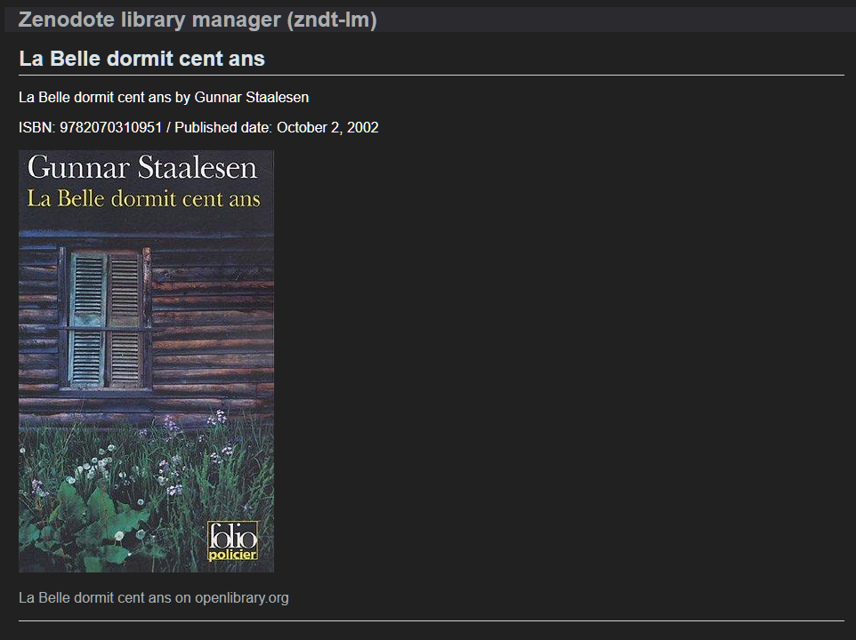

# Zenodote library manager (zndt-lm)


Zenodote is a "physical books" 📚 library manager based on web-queries using their ISBN (International Standard Book Number).

As detailled in paragraph "[about this project](#about-this-project)", this is a side project to self-learn and experiment different web technologies, not a fully featured product. It is written in Python and uses [Flask](https://palletsprojects.com/p/flask/) with SQLite.

For full featured "physical books" library manager, I warmly recommend [LibraryThing](https://www.librarything.com/) or its french equivalent [Babelio](https://www.babelio.com). LibraryThing is the type of application Zenodote library manager (zndt-lm) should be, but as already said, this is only an experimental side project. I used LibraryThing, with the help of its [Android application](https://play.google.com/store/apps/details?id=com.librarything.librarything), to catalog my [own library](https://www.librarything.com/catalog/Ludorg) and the result is very satisfying.

---

## Prerequisites

Zenodote library manager (zndt-lm) requires Python 3, a Linux installation and Visual Studio Code for edition.
The following non-standard Python packages are used and must be installed (see [Packages installation](#packages-installation) below):

- [requests](https://pypi.org/project/requests/)
- [verboselogs](https://pypi.org/project/verboselogs/)
- [coloredlogs](https://pypi.org/project/coloredlogs/)
- [Flask](https://pypi.org/project/Flask/)

Notable standard Python packages used by Zenodote are:

- sqlite3
- json
- logging
- unittest

TODO: Add detail on Azure deployment

### Code edition

Zenodote library manager (zndt-lm) is developped in Python 3 with [Visual Studio Code](https://code.visualstudio.com/) and its powerful [Python extension](https://marketplace.visualstudio.com/items?itemName=ms-python.python). Python source code is formatted with autopep8 (default value). [Linting](https://code.visualstudio.com/docs/python/linting) is performed with pylint. The configuration for this editor is given below. These parameters are workspace settings.

```json
{
    "python.testing.unittestArgs": [
        "-v",
        "-s",
        "./zenodote_py/app",
        "-p",
        "*test.py"
    ],
    "python.testing.pytestEnabled": false,
    "python.testing.nosetestsEnabled": false,
    "python.testing.unittestEnabled": true,
    "python.pythonPath": "zndt_env/bin/python",
    "python.autoComplete.extraPaths": [
        "./zenodote_py/app",
        "./zenodote_py/"
    ],
    "python.linting.pylintEnabled": true,
    "python.linting.enabled": true
}
```

[autopep8](https://pypi.org/project/autopep8/) may be installed with the following command, which was generated by VSCode:

```bash
/opt/python/latest/bin/python3.8 -m pip install -U autopep8 --user
```

[pylint](https://www.pylint.org/) may also be installed with pip as below, (this command is generated by VSCode):

```bash
/opt/python/latest/bin/python3.8 -m pip install -U pylint --user
```

### Setup development environment

Zenodote library manager (zndt-lm) runs on Linux. It was initially developed on Ubuntu 18.04.4 LTS in a VM running in Hyper-V. Migration to GitHub was made and tested with [Visual Studio Online](https://visualstudio.microsoft.com/services/visual-studio-online/), the cloud-powered dev environments provided by Microsoft.

It should be possible to run Zenodote library manager (zndt-lm) on Windows directly or with [Windows Subsystem for Linux](https://docs.microsoft.com/en-us/windows/wsl/about), the optional (and great) feature of Windows 10.

#### Virtual environment creation and optional venv installation

To setup Python virtual environement, if pip or venv are not available, install them. But, according to [official documentation](https://docs.python.org/3.8/installing/index.html), venv (the standard tool for creating virtual environments) is available and has been part of Python since Python 3.3. The commands hereafter may not be required.

```bash
sudo apt-get update
sudo apt-get install python3-venv
sudo apt-get install python3-pip python3-setuptools
```

In a bash terminal, create and activate a virtual environment for installing required packages.

```bash
python3.8 -m venv zndt_env
source ./zndt_env/bin/activate
```

Then, select the created environment in VSCode.


#### Packages installation

To avoid a warning on the installed version of pip, its upgrade is recommended and is a quick operation.

```bash
pip install --upgrade pip
```

Required packages can each be installed individually.

```bash
pip install verboselogs
pip install coloredlogs
pip install requests
pip install flask
```

All required packages can also be installed in a single command with the requirements.txt file.

```bash
pip install --no-cache-dir -r requirements.txt
```

#### Installing sqlite3 tool

Installing sqlite3 tool is not mandatory. It could help to inspect the database as shown below.

```bash
sudo apt-get install sqlite3
```


### Deployment as Azure App Service

TODO

---

## Using Zenodote library manager (zndt-lm)

### Database creation

Zenodote application is stored in the 'app' directory. First step when using Zenodote library manager is to create the database. The command to create it is given below. It must be run from root directory of this source tree. Folder 'instance' contains the created database zndt.sqlite.

```bash
FLASK_APP=app
flask init-db
```

### Add item from ISBN to database

To add an item to database, the python './app/add.py' script is used. It can be run with one ISBN number as argument and must be run from root directory of this source tree. Virtual environment must be activated before this operation.

```bash
source ../zndt_env/bin/activate
python3 ./app/add.py 9782070310951
deactivate
```


The cover image, if available, is downloaded locally in folder 'app/static/img\_data/'. A sub-folder named by ISBN is created and contains the image data for further display by the Zenodote web server.

To perform multiple add operations, a script 'zndt_add.sh' is provided. This script reads the content of 'isbn_list.txt' (one ISBN per line) and runs the python command './app/add.py'. The 'zndt_add.sh' script also activates virtual environment.

### Run the Zenodote library manager (zndt-lm) web server

To run the Zenodote web server, after virtual environment activation, just run 'flask run' command as below. The script 'zndt_run_server.sh' does the same but debugging is activated. Beware, application is not secured and should not be deployed as it is.

```bash
source ../zndt_env/bin/activate
FLASK_APP=app
flask run --host=0.0.0.0
```

Open the server main page in your browser (<http://your.ip.address:5000>). Default port for Flask server is 5000, but can be modified. The main page contains the paginated list of books stored in the SQLite database. Arrows in the upper right corner allow navigation between pages.


By clicking on a book title, it is possible to access the details of the book (author, title, publish date and a link for more details) and to display its cover, if it was available when added in database.



---

## ISBN Queries

During my early research work on Zenodote, I gathered some information regarding ISBN (International Standard Book Number) web queries. The following URL are web API (almost REST) to perform ISBN query and get information on books. Examples in the next list are made with ISBN [9782070310951](https://www.librarything.com/work/2124602/book/176871878): "La Belle Dormit Cent ans" by [Gunnar Staalesen](https://en.wikipedia.org/wiki/Gunnar_Staalesen).

- ISBNdb API: <http://isbndb.com/api/v2/docs/books>
- ISBNPlus API: <http://isbnplus.com/api/>
- Open Library API: <https://openlibrary.org/developers/api>
- Google Books API example: <https://www.googleapis.com/books/v1/volumes?q=isbn:9782020104821>
- Amazon Lookup by ISBN API: <https://docs.aws.amazon.com/AWSECommerceService/latest/DG/EX_LookupbyISBN.html>
- Google Search example: <https://www.google.com/search?tbm=bks&q=9782070310951>
- Amazon Search example: <https://www.amazon.com/s?search-alias=stripbooks&field-isbn=9782070310951>

Some sites that allowed to perform ISBN requests have disappeared since, Internet Archive snapshots are linked instead.

- OpenISBN: [http://www.openisbn.com/api.html](https://web.archive.org/web/20180201021905/http://www.openisbn.com/api.html)
- LookupISBN: [http://www.lookupisbn.com/](https://web.archive.org/web/20160329025351/www.lookupisbn.com/)

### Zenodote ISBN Queries

Zenodote library manager (zndt-lm) performs queries on Open Library and on Google Books. The JSON results are parsed and stored in a SQLite database. The cover images are downloaded and stored on local disk for further display.

The query (http GET) on Open Library for book with ISBN [9782070310951](https://www.librarything.com/work/2124602/book/176871878) is: <https://openlibrary.org:443/api/books?bibkeys=ISBN:9782070310951&format=json&jscmd=data>. The cover URL is then retrieved in JSON field 'cover/large'. This query is implemented in file isbn_ol.py.

When Open Library does not provide results, Google Books is then requested. The corresponding http GET request (again for book with ISBN [9782070310951](https://www.librarything.com/work/2124602/book/176871878)) is <https://www.googleapis.com/books/v1/volumes?q='9782070310951'>. This request is implemented in file isbn_gb.py.

---

## TODO and enhancement ideas

- [X] Migration from private Azure DevOps repo to GitHub public repo
- [ ] Deployment as Azure App Service
- [ ] Filter and sort in Zenodote web server
- [ ] Search in Zenodote web server
- [ ] User access control for web server
- [ ] Multi-user support
- [ ] Add book to database from web server
- [ ] Improve UI design

---

## About this project

### Some words on Zénodote the librarian

Zénodote is the french name of Zenodotus, who was the first superintendent of the Library of Alexandria.

_Zénodote, en grec ancien Ζηνόδοτος / Zênódotos (320–240 av. J.-C.), grammairien alexandrin.
Il est le premier bibliothécaire de la bibliothèque d'Alexandrie. Ptolémée II Philadelphe a recours à ses services, ainsi qu'à ceux d'Alexandre l'Étolien et Lycophron de Chalcis pour mettre au point des éditions critiques des grands poètes grecs. Alors que ses collègues prennent en charge respectivement les tragédies et les comédies, Zénodote s'attaque à l'œuvre d'Homère. Il publie une Recension (Διόρθωσις / Diórthôsis) ainsi qu'un Glossaire (Γλῶσσαι / Glôssai) de l’Iliade et de l’Odyssée, et rejette les Hymnes homériques comme étant postérieurs._

Source : [Zénodote (Wikipedia)](http://fr.wikipedia.org/wiki/Z%C3%A9nodote) [Zenodotus (Wikipedia)](https://en.wikipedia.org/wiki/Zenodotus)

[Social image for this GitHub repo](./doc/img/Ancientlibraryalexendria.jpg) is a nineteenth century artistic rendering of the Library of Alexandria by the German artist O. Von Corven, based partially on the archaeological evidence available at that time (see Wikipedia page on [Library of Alexandria](https://en.wikipedia.org/wiki/Library_of_Alexandria)).

### Origin of Zenodote library manager (zndt-lm)

Zenodote was my "pet project" which started in 2012/2013.
It initially aimed to be an ebook library manager.
A first and draft version of a client/server application was developed.
Server was written in C++ and client was a Java application which should also have been targeted Android.
This source code is not in this repo.

This early version was cancelled in 2013 and the project was in a frozen state until 2017.
Zenodote then became a "physical books" library manager based on web-queries using their ISBN (International Standard Book Number).

This side project was a practical way to self-learn and experiment different web technologies.
Some JavaScript tests were made with [Angular](https://angular.io/), [TypeScript](https://www.typescriptlang.org/) and then in Python with [Django](https://www.djangoproject.com/). Finally, mid-2019 Python with [Flask](https://palletsprojects.com/p/flask/) was chosen. Only this source code is stored in this public repo.

This code was initialy managed in a private [Azure DevOps](https://azure.microsoft.com/en-us/services/devops/repos/) repo: <https://dev.azure.com/ludorg/>. For public repo, GitHub was selected. There is no common history between these two Git repositories.

---

## Contact

If you want to contact me you can reach me at <ludorg@ludorg.net>.

## License

This project uses the following license: [MIT](https://github.com/Ludorg/zenodote_py/blob/master/LICENSE).
